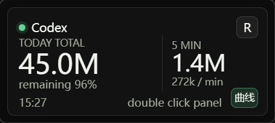
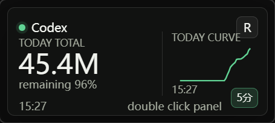
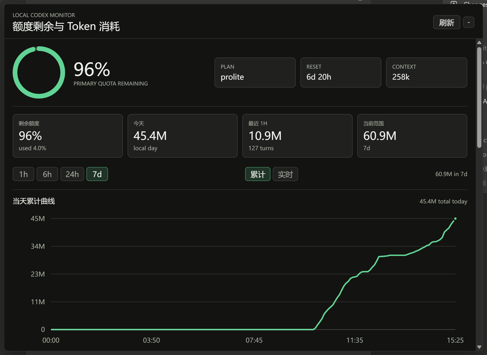
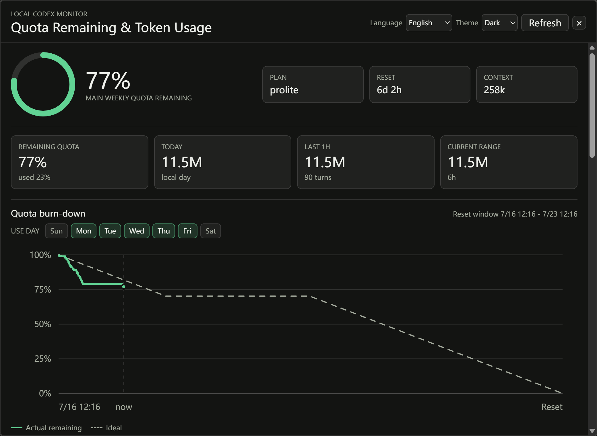
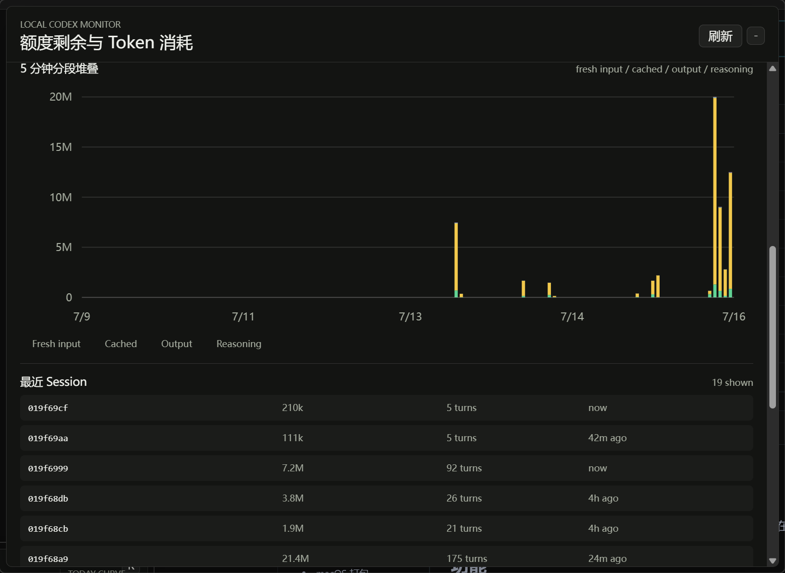

# Codex Quota Monitor

[English](README.md)

一个只监控 Codex 的本地 Tauri 桌面浮窗。数据只读取和记录在本机，不上传。

## 功能

- 读取本机 Codex session 日志中的 `token_count` 事件。
- 本地按分钟聚合 `input`、`cached input`、`output`、`reasoning output`。
- 小浮窗常驻桌面：左侧固定显示今日总 token，右侧可切换最近 5 分钟 token 或今日累计曲线。
- 双击小浮窗打开独立大面板。
- 大面板支持基于 reset 周期的额度燃尽图，可配置一周内的使用日；同时支持当天累计曲线和实时曲线切换，并包含 5 分钟分段堆叠图、额度剩余、最近 session。
- 小浮窗透明度可通过右键菜单或托盘菜单调整；大面板不受透明度影响。
- 支持暗色 / 亮色主题手动切换。
- 支持跟随系统语言，也可以手动切换 10 种常见语言。
- 系统托盘常驻；托盘创建失败时，主窗口仍会继续运行。

## 界面展示

小浮窗最近 5 分钟 token：



小浮窗今日累计曲线：



大面板当天累计曲线：



大面板额度燃尽图：



大面板 5 分钟分段堆叠：



## 数据位置

监控来源：

- Windows: `%USERPROFILE%\.codex\sessions`
- macOS/Linux: `$HOME/.codex/sessions`
- 可通过 `CODEX_HOME` 覆盖 Codex 目录。

本地缓存：

- Windows: `%APPDATA%\CodexQuotaMonitor\usage-cache.json`
- macOS: `~/Library/Application Support/CodexQuotaMonitor/usage-cache.json`
- Linux: `$XDG_CONFIG_HOME/CodexQuotaMonitor/usage-cache.json` 或 `~/.config/CodexQuotaMonitor/usage-cache.json`
- 可通过 `CODEX_QUOTA_MONITOR_HOME` 覆盖缓存目录。

## 开发

通用：

```bash
npm install
npm run dev
```

Windows 如果当前 shell 没有初始化 MSVC 环境：

```powershell
npm install
npm run dev:win
```

macOS：

```bash
npm install
npm run dev:mac
```

## Windows 打包

依赖：

- Node.js 20+
- Rust stable
- Visual Studio Build Tools 2022 或 Visual Studio Community，包含 MSVC C++ 工具链和 Windows SDK
- WebView2 Runtime

打包：

```powershell
npm install
npm run build:win
```

常见产物：

- `src-tauri/target/release/codex-quota-monitor.exe`
- `src-tauri/target/release/bundle/msi/Codex Quota Monitor_0.1.0_x64_en-US.msi`
- `src-tauri/target/release/bundle/nsis/Codex Quota Monitor_0.1.0_x64-setup.exe`

如果已经在 Developer PowerShell 或已初始化 MSVC 的环境中，也可以使用：

```powershell
npm run build
```

## macOS 打包

当前代码支持 macOS 源码构建和打包，但 macOS 产物必须在 macOS 机器上生成。

依赖：

- Node.js 20+
- Rust stable
- Xcode Command Line Tools

准备：

```bash
xcode-select --install
npm install
```

打包：

```bash
npm run build:mac
```

常见产物位置：

- `src-tauri/target/release/bundle/macos/`
- `src-tauri/target/release/bundle/dmg/`

未配置 Apple Developer 签名时，生成的 `.app` 或 `.dmg` 可能需要在本机安全设置中手动允许运行。正式分发建议补充 macOS signing/notarization 配置。

## 说明

仓库不提交本机构建产物、`node_modules`、Tauri target 目录或本机专用 Cargo 配置。

## 许可证

WTFPL。详见 [LICENSE](LICENSE)。
